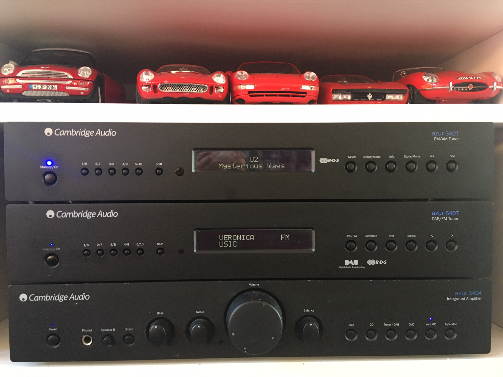
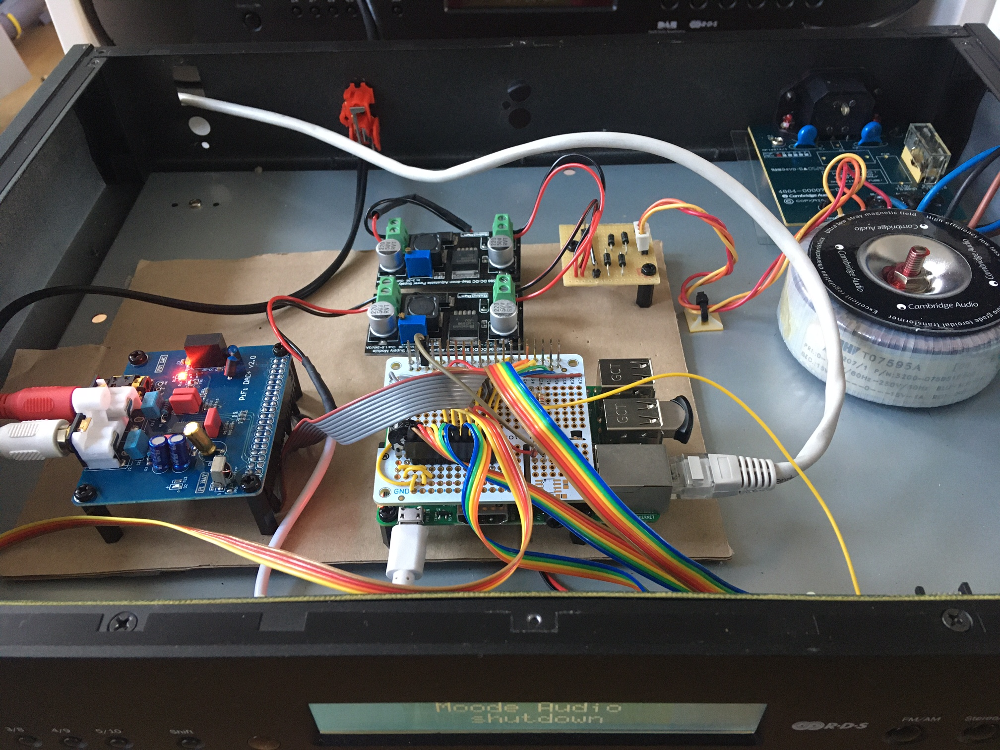

# MAUI - MPD Audio User Interface
This module let you use any MPD based audio player using your own hardware buttons and/or LCD screen. Developed to integrate a Raspberry Audio player in my audioset and reuse the LCD and buttons from a second hand tuner. I use Moode Audio but this should work with any MPD based audio setup i.e XBMC/Kodi.

Picture below shows my audio setup, top device is a modified tuner which internals are replaced by a Raspberry PI 3B running Moode Audio.

It is developed for my own usage. Tested only on my own setup.

## Build your own audio setup
1. Buy a second hand audio component that fits your setup
1. Remove the internals, but keep
	* Display
	* Buttons
	* External connectors
	* Power supply
1. Add Raspberry
1. Add audi DAC (optional, but recommended)
1. Attach buttons to Raspberry PI
1. Attach display to Raspberry PI

# Hardware design

## Wakeup GPIO3 (PIN5)
GPIO3 is a special IO pin on the Raspberry PI. If the Raspberry PI is shut down by the shutdown command. Connecting this IO to ground wakes up the Raspberry PI. (When the Raspberry PI is power off, you must disconnect power supply and reconnect)

## Single shutdown button
I wanted a single momentary push button to switch on/off the Raspberry Pi. Switch on (wakeup) can be done by pulling GPIO3 to ground. 
GPIO3 is also used by the HifiBerry and other DAC´s so it can´t be used as a shutdown button (its reserved by the DAC).
The best solution for me was this brilliant solution on [stackexchange](https://raspberrypi.stackexchange.com/questions/47832/shutdown-button-for-raspberry-pi-with-hifiberry-amp-hat)
The same physical button is wired to two GPIO´s, GPIO3 for wakeup, and a arbitrary other GPIO to attach the shutdown function to.

## On/Off led
The physical enclosure I used had a led to show if the device is turned on. I connected the Led (using a resistor to limit the current) to GPIO14 (TXD)
To enable this function the following line needs to be added to /boot/config.txt
`enable_uart=1`
The full description can be found on [howchoo](https://howchoo.com/g/ytzjyzy4m2e/build-a-simple-raspberry-pi-led-power-status-indicator).

## Enclosure considerations
The Cambridge Audio enclosure I used has limited space. This prohibited the stacking of the audio DAC board on the Raspberry PI. If you want to make it yourself easy, choose an enclosure that will fit the stacked boards or has enough space to install them vertical. 
The LCD from the enclosure needed at least 6 volts for the backlight to function. 
I reused the beautiful *toroidal transformer* from Cambridge. Most high end audio systems have stable and efficient transformers that can easily be reused.
To reuse the buttons and led I removed the unwanted traces on the PCB with a small angle grinder. 
As you can see on the picture, the internals still need a little sort out.

# Software setup

## Design
* All python code
* Easy configurable using ini file

## Prerequisites
[Python3](https://www.python.org/downloads/)
Non-standard Python packages
* [Python-MPD2](https://pypi.org/project/python-mpd2/) 
Module to connect to music player daemon. 
Download and install using PIP:	`sudo pip install python-mpd2`
* [gpiozero]( https://gpiozero.readthedocs.io/en/stable/) 
Easy usage of GPIO pins. Lcdzero makes use of gpiozero to handle the LCD screen. 
Download and install using PIP:	`sudo pip install gpiozero`
* [configparser](https://docs.python.org/3/library/configparser.html) 
Read settings from the maui.ini file (not sure it is a non-standard package) 
Download and install using PIP:	`sudo pip install configparser`

## Copy MAUI files
### create directory 
`sudo mkdir /usr/local/maui` 
`sudo cd /usr/local/maui`

### place folowing files in this directory 
`maui.py` 
`maui.ini` 
`mpdi.py` 
`buttons.py` 
`lcdzero.py` 

## edit maui.ini
Edit the maui.ini file so it resembles you settings/gpio setup. 

Now it should be possible to test the setup by entering:
`sydo python3 maui.py --test mpd`	test *music player deamon* connection 
`sydo python3 maui.py --test lcd`	test *lcd*,shows some test information 
`sydo python3 maui.py --test buttons`	test *buttons* connections, press a connected button, result will be shown on terminal 
`sudo python3 maui.py`	run maui, see *Start as Service* on how to start maui after a reboot

## Start as Service (systemd)
In order to start maui automatically after a reboot, you can install maui as a systemd service. This are the steps to do that (on Raspbery PI OS and various other Linux flavours).
*the following actions need **root´** privileges, use them as root or prefix them with `sudo `.*
Create a file named *`maui.service`* in `/usr/lib/systemd/system`. The file has the following contents: 
`[Unit]` 
`Description=MPD Audio User Interface` 
`[Service]` 
`ExecStart=/usr/bin/python3 /usr/bin/maui/maui.py` 
`WorkingDirectory=/usr/bin/maui` 
`StandardOutput=inherit` 
`StandardError=inherit` 
`[Install]` 
`WantedBy=default.target` 

To install the service you have to enter the following command: 
`systemctl enable maui` 
After a reboot the service should be active.

Some other command´s I found useful:
* `systemctl daemon-reload` - reloads service files, to update the daemon without an reboot.
* `systemctl status maui` or `systemctl status mpd` gives the current status of the service maui or mpd.
* `journalctl -u maui` shows the log of the maui service
* `systemctl start maui` or `systemctl stop maui` starts and stops the service, useful if you change the software on the fly

