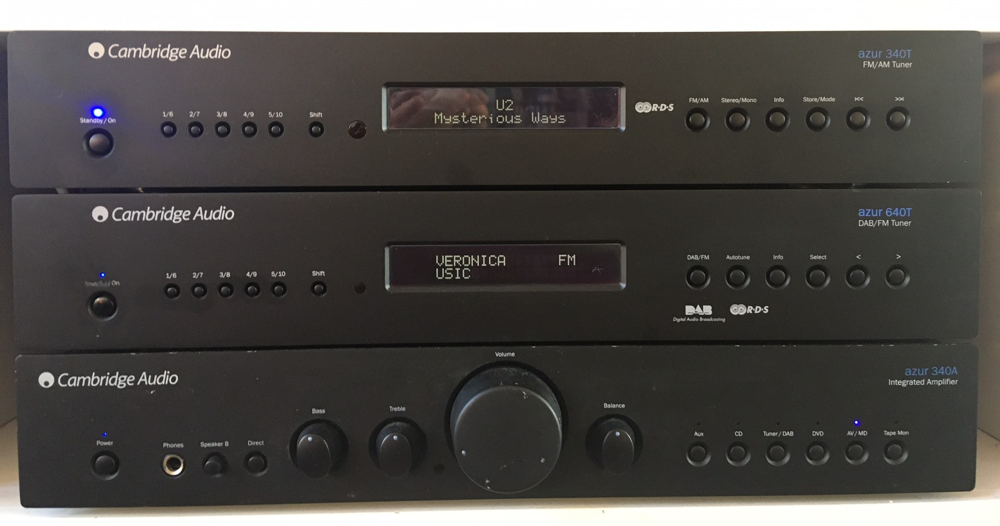

# MAUI - MPD Audio User Interface
This module let you use any MPD based audio player using your own hardware buttons and/or LCD screen. Developed to reuse the buttons and lcd from my audioset to control a Raspberry PI audio setup. I choose Moode Audio but should work with any MPD based audio setup i.e XBMC/Kodi.

Picture below shows my audio setup, top device is a modified tuner which internals are replaced by a Raspberry PI 3B running Moode Audio.

It is developed for my own usage. Tested only on my own setup.
Build your own audio setup
1. Buy a second hand audio component that fits your setup
1. Remove the internals, but keep
	* Display
	* Buttons
	* External connectors
	* Power supply
1. Add Raspberry
1. Add audi DAC (optional, but recommended)
1. Attach buttons to Raspberry PI
1. Attach display to Raspberry PI

* All python code
* Easy configurable using ini file

External libraries:
	gpiozero
	mpd2
